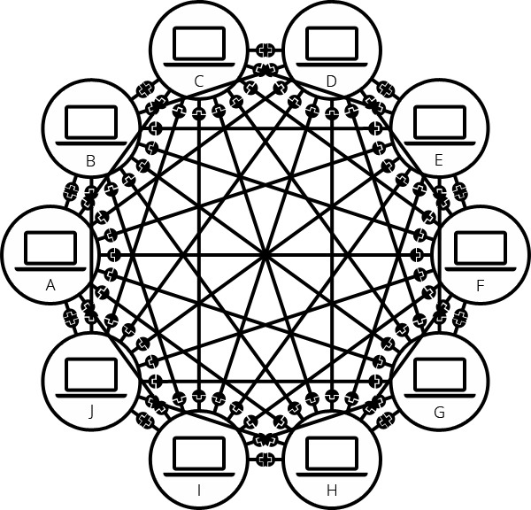
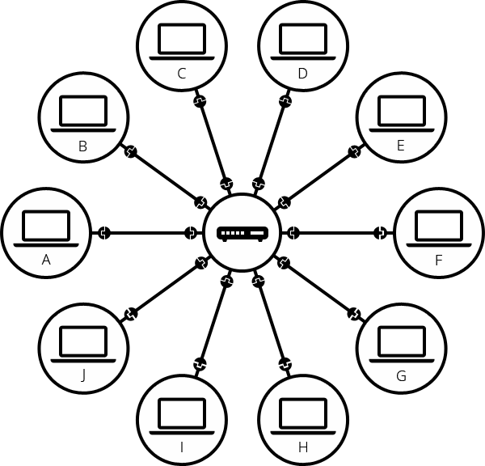
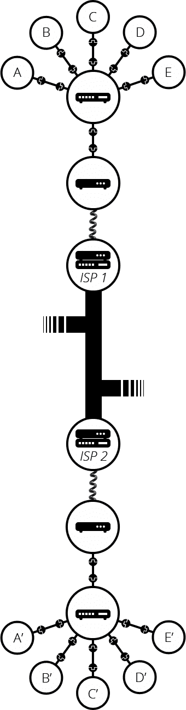

## 인터넷 (Internet)

> 컴퓨터로 연결하여 **TCP/IP** 라는 통신 프로토콜을 이용해 정보를 주고 받는 컴퓨터 네트워크

### 인터넷의 작동원리

**단순한 네트워크**

1. 1:1 연결

- 두 대의 컴퓨터가 통신이 필요할 때, 다른 컴퓨터와 물리적으로 또는 무선으로 연결되어야 한다.

2. N:N 연결
   

- 위처럼 연결하는 컴퓨터의 수가 많아지면 복잡성이 증가한다.

3. 라우터 연결

- 위 문제를 해결하기 위해 네트워크의 각 컴퓨터는 라우터(Router)를 연결한다.

> Router: 특수한 소형 컴퓨터로 단 하나의 작업만 수행.



**네트워크 안의 네트워크**

- 수백, 수천대의 컴퓨터를 연결하려면 라우터와 라우터를 연결하면 된다.

라우터와 라우터를 연결함으로 연결을 무한하게 확장 가능해졌다.

하지만, 라우터를 대륙 간의 라우터 유선 연결은 힘들기 비효율 적이기 때문에

모뎀(MODEM) 이라는 특수 장비를 이용해 네트워크와 전화시설을 연결한다.

- 모뎀은 네트워크의 정보를 전화시설에서에서 처리 가능한 정보로 바꿔준다.
- 모뎀을 통해 네트워크는 전화시설에 연결되었다. 이제 네트워크에서 네트워크로 정보를 보낼 때에는 ISP에 연결한다.
  > ISP (인터넷 서비스 제공업체) : 모두 연결되어 있는 특수한 라우터를 관리하고 다른 ISP의 라우터에도 엑세스 할 수 있는 회사
  > ex) SKT, KT

즉 인터넷의 작동원리는

```
내 컴퓨터 -> 라우터 -> 모뎀 -> ISP1 -> ISP2 -> 모뎀 -> 라우터 -> 상대방 컴퓨터
```


