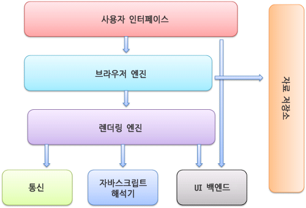

## 브라우저는 어떻게 동작할까 ?

### 브라우저의 주요기능

- 사용자가 선택한 자원을 서버에 요청하고 브라우저에 표시하는 것이다. 자원의 주소는 URI(Uniform Resource Identifier)에 의해 정해진다.

### 브라우저의 기본 구조

1. 사용자 인터페이스

   - 주소 표시줄, 이전/다음 버튼, 북마크 메뉴 등. 요청한 페이지를 보여주는 창을 제외한 나머지 모든 부분.
      

2. 브라우저 엔진
   - 사용자 인터페이스와 렌더링 엔진 사이의 동작을 제어한다.
3. 렌더링 엔진
   - 요청한 콘텐츠를 표시한다.
     ex) HTML을 요청하면 HTML 과 CSS를 파싱하여 화면에 표시함
4. 통신
   - HTTP 요청과 같은 네트워크 호출에 사용된다. 이것은 플랫폼마다 독립적인 인터페이스이고 각 플랫폼 하부에서 실행된다.
5. UI 백엔드
   - 콤보 박스와 창 같은 기본적인 장치를 그린다. 플랫폼에서 명시하지 않은 일반적인 인터페이스로써, OS 사용자 인터페이스 체계를 사용한다.
6. JS Interpreter
   - 자바스크립트 코드를 해석하고 실행한다.
7. 자료 저장소
   - 자료를 저장하는 계층이다. 쿠키를 저장하는 것과 같이 모든 종류의 자원을 하드 디스크에 저장할 필요가 있다.

### 렌더링 엔진

렌더링 엔진의 역할은 요청 받은 내용을 브라우저 화면에 표시하는 일이다.

렌더링 엔진은 HTML 및 XML 문서와 이미지를 표시할 수 있다. 물론 플러그인이나 브라우저 확장 기능을 이용해 PDF와 같은 다른 유형도 표시할 수 있다. 그러나 이 장에서는 HTML과 이미지를 CSS로 표시하는 주된 사용 패턴에 초점을 맞출 것이다.

#### 렌더링 엔진들

이 글에서 다루는 브라우저인 파이어폭스와 크롬, 사파리는 두 종류의 렌더링 엔진으로 제작되었다. 파이어폭스는 모질라에서 직접 만든 게코(Gecko) 엔진을 사용하고 사파리와 크롬은 웹킷(Webkit) 엔진을 사용한다.

웹킷은 최초 리눅스 플랫폼에서 동작하기 위해 제작된 오프소스 엔진인데 애플이 맥과 윈도우즈에서 사파리 브라우저를 지원하기 위해 수정을 가했다.

#### 동작 과정

렌더링 엔진은 통신으로부터 요청한 문서의 내용을 얻는 것으로 시작하는데 문서의 내용은 보통 8KB 단위로 전송된다.

렌더링 엔진의 기본적인 동작 과정은 아래와 같다.

렌더링 엔진은 HTML 문서를 파싱하고 '콘텐츠 트리' 내부에서 태그를 DOM 노드로 변환한다. 그 다음 외부 CSS 파일과 함께 포함된 스타일 요소도 파싱한다. 스타일 정보와 HTML 표시 규칙은 '렌더 트리' 라고 부르는 또 다른 트리를 생성한다.

렌더 트리는 색상 또는 면적과 같은 시각적 속성이 있는 사각형을 포함하고 잇는데 정해진 순서대로 화면에 표시된다.

렌더 트리 생성이 끝나면 배치가 시작되는데 이것은 각 노드가 화면의 정확한 위치에 표시되는 것을 의미한다. 다음은 UI 백엔드에서 렌더 트리의 각 노드를 가로지르며 형상을 만들어 내는 그리기 과정이다.

일련의 과정들이 점진적으로 진행된다는 것을 아는 것이 중요하다. 렌더링 엔진은 좀 더 나은 사용자 경험을 위해 가능하면 빠르게 내용을 표시하는데 모든 HTML을 파싱할 때까지 기다리지 않고 배치와 그리기 과정을 시작한다. 네트워크로부터 나머지 내용이 전송되기를 기다리는 동시에 받은 내용의 일부를 먼저 화면에 표시한다.

#### 동작 과정 예 (webkit)

### 파싱과 DOM 트리 구축

#### 파싱 일반

파싱은 렌더링 엔진에서 매우 중요한 과정이기 때문에 더 자세히 다룰 필요가 있다. 파싱에 대한 간단한 소개로 시작한다.

문서 파싱은 브라우저가 코드를 이해하고 사용할 수 있는 구조로 변환하는 것을 의미한다. 파싱 결과는 보통 문서 구조를 나타내는 노드 트리인데 파싱 트리 또는 문법 트리라고 부른다.

예를 들어 2+3-1 과 같은 표현식은 다음과 같은 트리가 된다.

#### 문법

파싱은 문서에 작성된 언어 또는 형식의 규칙에 따르는데 파싱할 수 있는 모든 형식은 정해진 용어와 구문 규칙에 따라야 한다. 이것을 문맥 자유 문법이라고 한다. 인간의 언어는 이런 모습과는 다르기 때문에 기계적으로 파싱이 불가능하다.

#### 파서-어휘 분석기 조합

파싱은 어휘 분석과 구문 분석이라는 두 가지로 구분할 수 있다.

어휘 분석은 자료를 토큰으로 분해하는 과정이다. 토큰은 유효하게 구성된 단위의 집합체로 용어집이라고도 할 수 있는데 인간의 언어로 말하자면 사전에 등장하는 모든 단어에 해당된다.

구문 분석은 언어의 구문 규칙을 적용하는 과정이다.

파서는 보통 두 가지 일을 하는데 자료를 유효한 토큰으로 분해하는 어휘 분석기(a.k.a 토큰 변환기) 가 있고 언어 구문 규칙에 따라 문서 구조를 분석함으로써 파싱 트리를 생성하는 파서가 있다. 어휘 분석기는 공백과 줄 바꿈 같은 의미 없는 문자를 제거한다.

파싱 과정은 반복된다. 파서는 보통 어휘 분석기로부터 새 토큰을 받아서 구문 규칙과 일치하는지 확인한다. 규칙에 맞으면 토큰에 해당하는 노드가 파싱 트리에 추가되고 파서는 또 다른 토큰을 요청한다.

규칙에 맞지 않으면 파서는 토큰을 내부적으로 저장하고 토큰과 일치하는 규칙이 발견될 때까지 요청한다. 맞는 규칙이 없는 경우 예외로 처리하는데 이것은 문서가 유효하지 않고 구문 오류를 포함하고 있다는 의미다.
