## 자바스크립트 동작원리

### Javascript Engine

> Javascript 코드를 실행하는 프로그램 또는 인터프리터이다.

Chrome 과 Node.js에서 사용하는 대표적인 자바스크립트 엔진인 구글의 V8을 예로 들어보겠다.

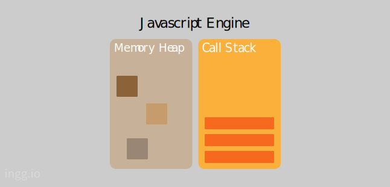

- Memory Heap : 메모리 할당이 일어나는 곳

- Call Stack : 코드 실행에 따라 호출 스택이 쌓이는 곳

#### Call Stack

자바스크립트는 기본적으로 작업을 싱글 스레드로 처리한다.
즉, 단 하나의 호출 스택을 사용한다.
호출 스택에 쌓인 함수나 코드를 위에서부터 아래로 차례로 실행한다.
작업을 차례로 실행하므로 하나의 작업이 끝날 때까지 또 다른 작업을 실행하지 않는다.

```js
function first() {
  second();
  console.log('첫번째');
}
function second() {
  third();
  console.log('두번째');
}
function third() {
  console.log('세번째');
}
first();
```

먼저 first 함수가 호출, 그 안의 second 함수가 호출, 마지막으로 third 함수가 호출된다.

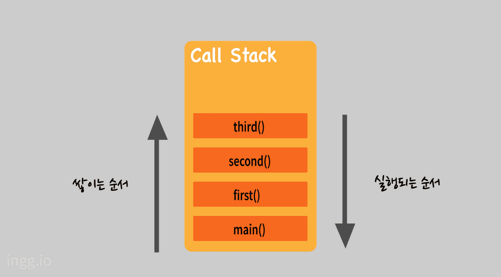

main() 함수는 처음 실행시 생성되는 전역 컨텍스트(함수가 호출 되었을 때 생성되는 환경)이다.
third, second, first, main 순으로 pop 되고 main 함수까지 실행완료되면 호출 스택이 비워진다.
따라서 위 코드는 세번째, 두번째, 첫번째 순으로 console 에 찍힌다.

### Javascript Runtime

자바스크립트 엔진 밖에서도 자바스크립트에 관여하는 요소들이 있다.
(Web API, Task Queue, Event Loop ..etc)

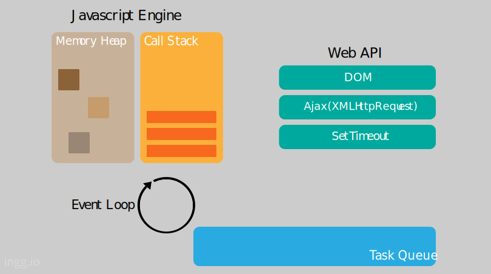

- **Web API**: Web API는 **브라우저에서 제공되는 API**이다.
  자바스크립트 엔진에서 정의되지 않았던 setTimeout이나 HTTP 요청(ajax) 메소드, DOM 이벤트 등의 메소드를 지원한다.
- **Task Queue**: 이벤트 발생 후 호출되어야 할 **콜백 함수들이 기다리는 공간**.
  이벤트 루프가 정한 순서대로 줄을 서 있으므로 콜백(Callback Queue) 라고도 한다.
- **Event Loop**: 이벤트 발생 시 호출할 **콜백 함수들을 관리하고, 호출된 콜백 함수의 실행 순서를 결정**한다.

#### Task Queue

자바스크립트에서 비동기로 호출되는 함수들은 Call Stack에 쌓이지 않고 Task Queue로 보내진다.

```js
console.log('A');
setTimeout(function () {
  console.log('B');
}, 0);
console.log('C');
```

result: "A", "C", "B"

### 비동기적 자바스크립트

비동기 처리란 특정 코드가 종료되지 않았어도 대기하지 않고 다음 코드를 실행하는 자바스크립트의 특성이다.

#### 자바스크립트에서 비동기 처리가 필요한 이유

화면에서 서버로 데이터를 요청했을 때 서버가 언제 그 요청에 대한 응답을 할 지도 모르는 상태에서 다른 코드를 실행하지 않고 기다릴 수는 없기 때문이다.

```js
console.log('시작');

setTimeout(function () {
  console.log('3초 후 실행');
}, 3000);

console.log('끝');
// 시작 -> 끝 -> 3초 후 실행
```

1. 먼저 전역 컨텍스트 main() 함수가 Call Stack 에 쌓이고 console.log("시작")이 Call Stack에 쌓인다. "시작" 이 console에 찍힌다.
   

2. console.log("시작")이 return 되면서 Call Stack에서 pop 된다.
   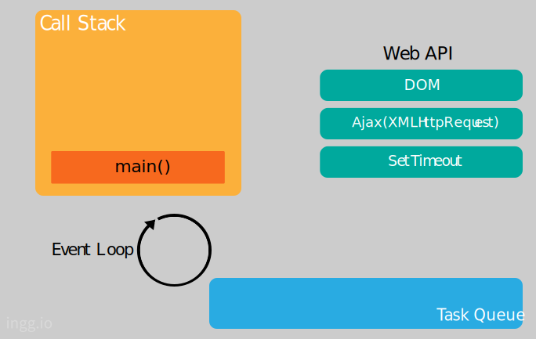

3. setTimeout 함수가 실행되면서 Call Stack에 setTimeout 함수가 들어간다.
   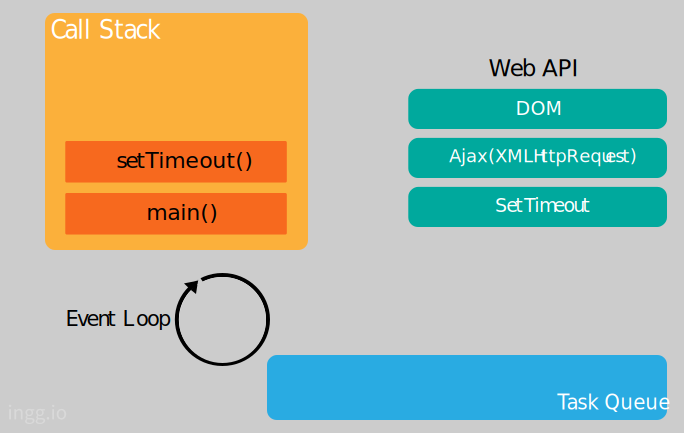

4. setTimeout 함수는 자바스크립트 엔진이 처리하지 않고 Web API가 처리하므로 CallBack 함수를 전달하고, setTimeout 작업을 요청한다.
   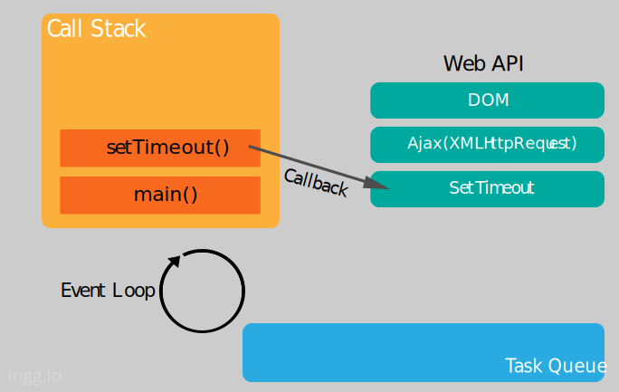

5. Call Stack 에서는 setTimeout 작업이 제거된다.
   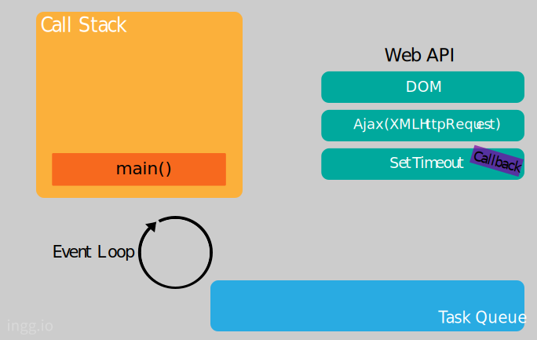

6. console.log("끝") 이 호출되어 Call Stack에 쌓인다. "끝"이 console에 찍힌다.
   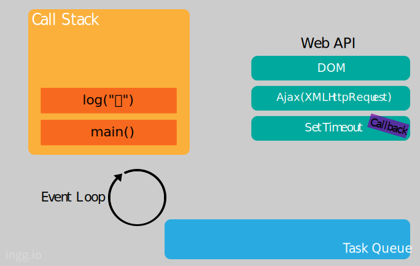

7. console.log("끝") 이 리턴되며 Call Stack 에서 pop 된다.
   

8. main() 이 리턴되며 Call Stack 에서 pop 된다.
   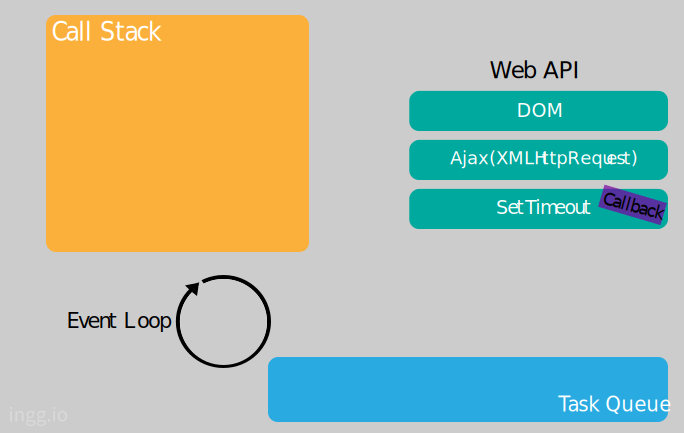

9. **Web API**는 setTimeout 작업을 실행한다. 3초를 센 후 **Task Queue** 로 Callback 함수를 보낸다.
   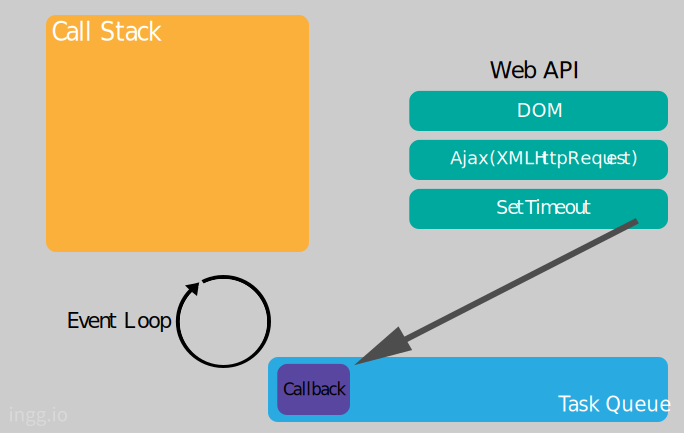

10. **Event Loop** 는 Call Stack 이 비어있으면 Task Queue에서 함수를 하나씩 꺼내 Call Stack에 넣고 실행한다.
    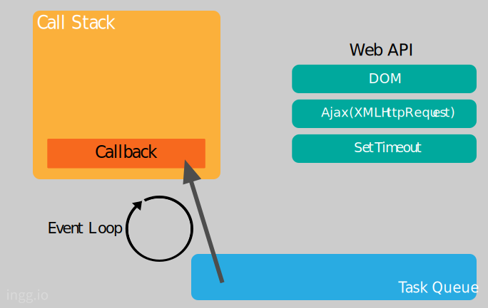

11. console.log("3초 후 실행") 이 호출되고 Call Stack 에 쌓인다. "3초 후 실행" 이 console에 찍힌다.
    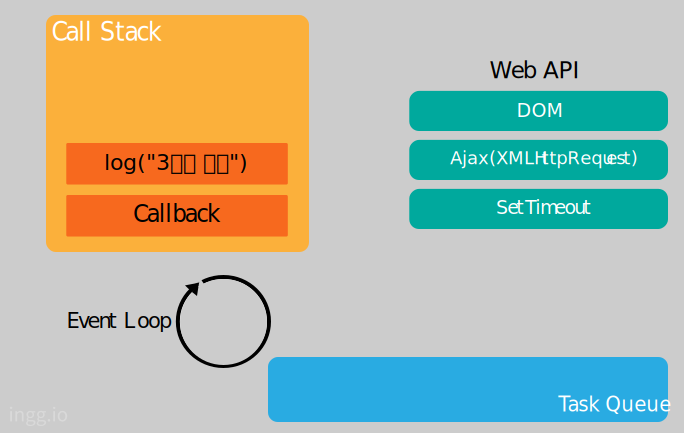

12. console.log("3초 후 실행") 이 리턴되고 Call Stack에서 제거된다. 차례로 Callback 함수도 제거된다. Event Loop 는 Task Queue 에 Callback 함수가 들어올 때까지 계속 대기한다.
    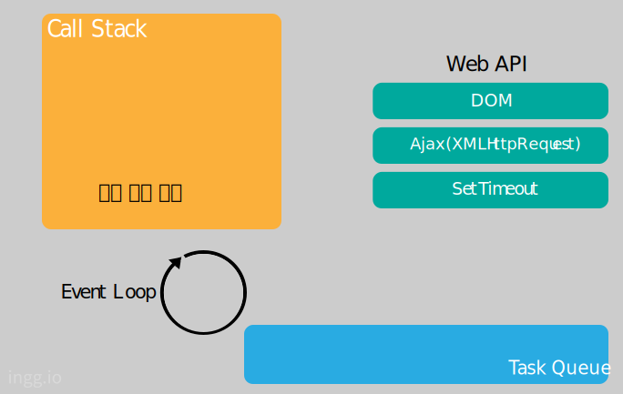

**etc.** 만약 Call Stack 에 함수들이 너무 많이 차있으면 3초 후 실행되지 않을 수도 있다.
Event Loop 는 Call Stack이 비어있을 때만 Task Queue 의 함수를 Call Stack으로 가져오기 때문이다.
이게 setTimeout() 시간이 정확하지 않을 수도 있는 이유이다.
