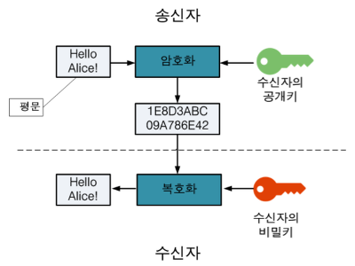

# HTTP vs HTTPS

#### HTTP 란?

> Hyper Text Transfer Protocol,
> W3 상에서 데이터를 주고 받기 위한 프로토콜이다.

즉, http 는 인터넷에서 하이퍼 텍스트를 교환하기 위한 통신규약으로, 80번 포트를 사용하고 있다.

#### HTTP의 구조

http는 애플리케이션 레벨의 프로토콜로 TCP/IP 위에서 작동한다.
상태를 갖고 있지 않는 Stateless 프로토콜이며,
Method, Path, Version, Headers, Body 등으로 구성된다.

하지만, **http 는 암호화가 되지 않은 평문 데이터를 전송하는 프로토콜**이였기 때문에, http로 비밀번호나 주민등록번호 등을 주고 받으면 제 3자가 정보를 조회할 수 있었다.
이를 **해결하기 위해 HTTPS** 가 등장하게 됐다.

#### HTTPS 란?

> HyperText Transfer Protocol over
> Secure Socket Layer, TLS, SSL, Secure
> 등으로 불리는 HTTPS 는 HTTP에 데이터 암호화가 추가된 프로토콜이다.
> 443 포트를 사용하며, 네트워크 상에서 제 3자가 정보를 볼 수 없도록 공개키 암호화를 지원한다.

#### 공개키/개인키

https는 공개키/개인키 암호화 방식을 이용해 데이터를 암호화하고 있다. 공개키와 개인키는 서로를 위한 한 쌍의 키이다.

- 공개키: 모두에게 공개 가능한 키
- 개인키: 나만 알고 있어야 하는 키

공개키와 개인키로 암호화하면 얻을 수 있는 효과

- 공개키 암호화: 개인키로만 복호화 할 수 있다 -> 개인키는 나만 가지고 있으므로, **나만 볼 수 있다.**
- 개인키 암호화: 공개키로만 복호화 할 수 있다 -> 공개키는 모두에게 공개되어 있으므로, **내가 인증한 정보임을 알려 신뢰성을 보장**할 수 있다.

HTTPS 는 **SSL** 과 같은 프로토콜을 사용하여 공개키 / 개인키 기반으로 데이터를 암호화하고 있다.

> SSL 인증서는 사용자가 사이트에 제공하는 정보를 암호화한다.

또, HTTPS는 **TLS(전송 계층 보안)** 프로토콜을 통해서도 보안을 유지한다.

> TLS 는 데이터 무결성을 제공하기 때문에 데이터가 전송 중에 수정되거나 손상되는 것을 방지하고, 사용자가 자신이 의도하는 웹사이트와 통신하고 있음을 인증하는 역할도 한

**3줄 요약**

1. HTTPS 가 보안성이 좋다.
2. HTTPS 를 사용하는 웹사이트는 구글에서 SEO 가산점을 준다.
3. 이미 HTTPS 는 표준 프로토콜이 되어가고 있다.
